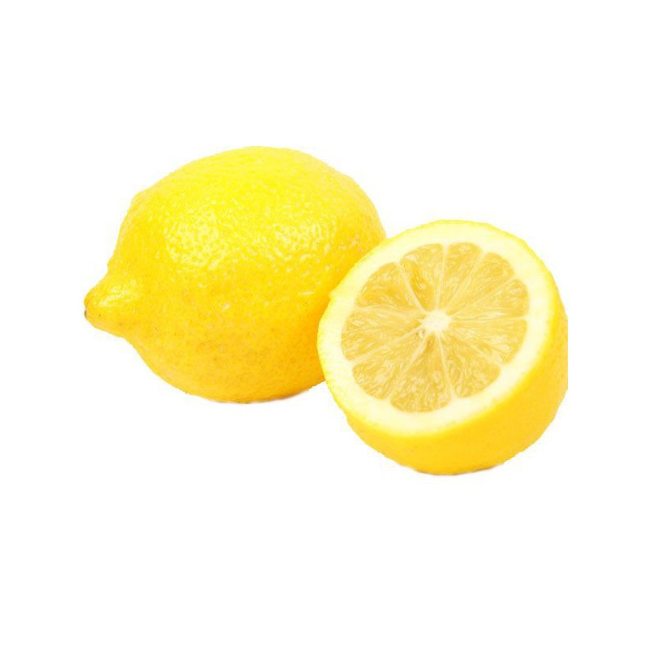
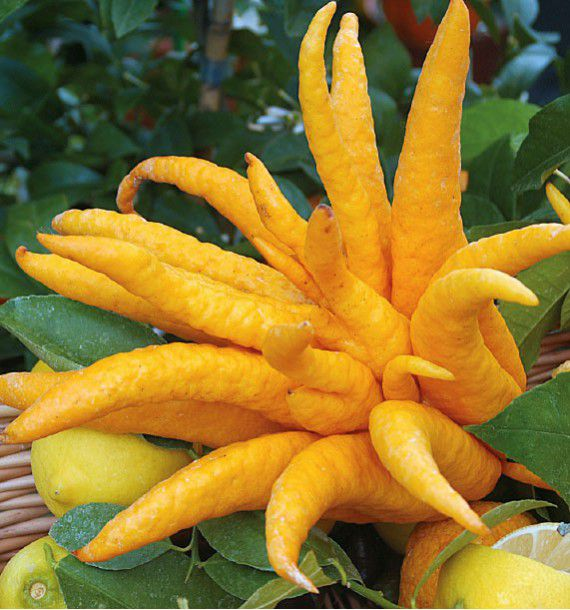
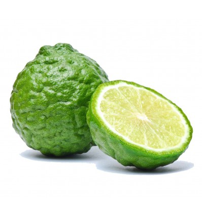

Skip to content
Search or jump to…

Pull requests
Issues
Marketplace
Explore
 
@AsiimovOnlyOne 
Learn Git and GitHub without any code!
Using the Hello World guide, you’ll start a branch, write comments, and open a pull request.

AsiimovOnlyOne
/
Mon-site-moi
Template
1
00
Code
Issues
Pull requests
Actions
Projects
Wiki
Security
Insights
Settings
Mon-site-moi/site citrons/index.html
@AsiimovOnlyOne
AsiimovOnlyOne Add files via upload
Latest commit cabc3b9 13 minutes ago
 History
 1 contributor
25 lines (25 sloc)  2.53 KB
  
<!doctype html>
<html lang="fr">
<head>
	<meta charset="utf-8">
	<link rel="stylesheet" type="text/css" href="style.css">
	<title>Les citrons</title>
</head>
<body>
	<h1>Bienvenue sur ce magnifique site web ! Vous allez y découvrir toutes les variétés de citron du monde !</h1>
	<h2 class="titre1">Tout d'abord, commençons par les <u>Citrons jaunes</u>. En effet, ces derniers sont très populaires et ce sont les plus couramment utilisés.</h2>
	
	<h3>Ils sont très populaires et possèdent donc de multiples variétés rien que pour eux ! <a href="citrons jaunes.html">Cliquez ici pour vous diriger vers un site web représentant en détail chaque type de citron jaune.  </a></h3>
	<h2>Pour en revenir à nos précieux citrons, nous continuons cette présentation par le <u>Citron meyer</u> et le <u>Citron caviar</u> !</h2>
	
<h2 class="desc1">Le citron meyer a une peau jaune et orangée  résultant d'un croisement entre une orange  et un citron. Originaire de Chine, ce citron   porte le de Franck Meyer, la personne qui  l'a introduite aux Etats Unis en 1908 !</h2>
	
	<h2 class="desc2">Le citron caviar est long et assez mince.   Sa peau vert foncé a la particularité de   contenir des billes croquantes de la même   manière que le caviar ! Ce citron est plutôt   rare et pousse dans les forêts australiennes.</h2>
	<h2 class="title2">Suite à cela, nous avons les <u>Main de Bouddha</u> et <u>Combava</u> !</h2>
	
	<h2 class="desc3">La main de bouddha se distingue   particulièrement par sa forme : des petites   sections rappelant des doigts ! La peau de ce   fruit est également très épaisse.</h2>
	
	<h2 class="desc4">Ce petit citron rond et légèrement aplati   est essentiellement cultivé en Asie du Sud-Est,   à la Réunion et à Madagascar. Son écorce,   vert foncé ou jaune est à l'origine d'huiles   aromatiques diveres !</h2>
	<h2 class="title3">A partir du citron, il est également possible de faire des choses spectaculaires, comme de l'encre invisible ! <a href="https://fr.wikipedia.org/wiki/Encre_invisible">Cliquez ici si vous voulez en savoir plus sur cette fameuse encre invisible !</a></h2>
</body>
</html>
© 2020 GitHub, Inc.
Terms
Privacy
Security
Status
Help
Contact GitHub
Pricing
API
Training
Blog
About
